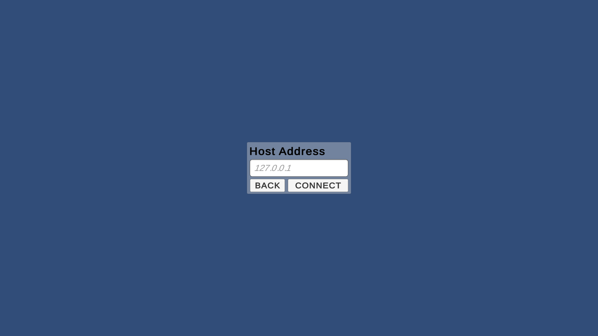
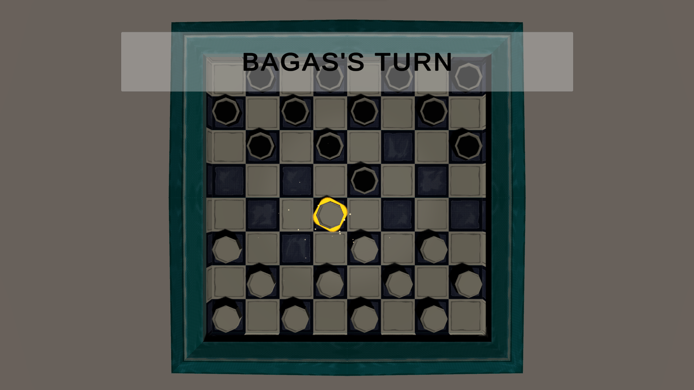
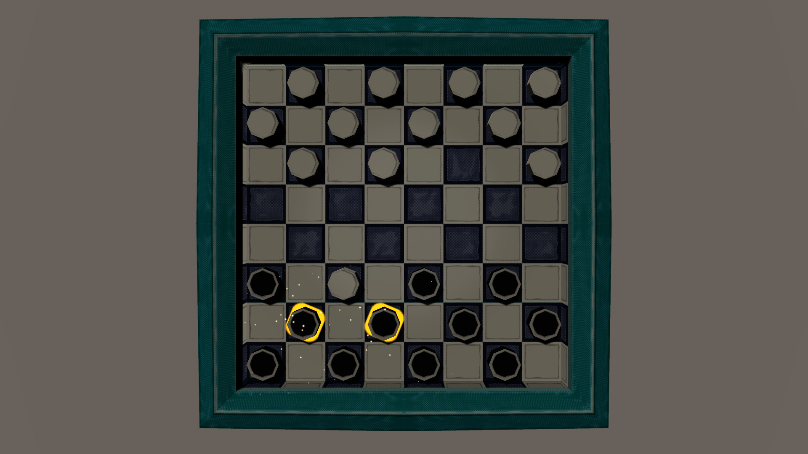
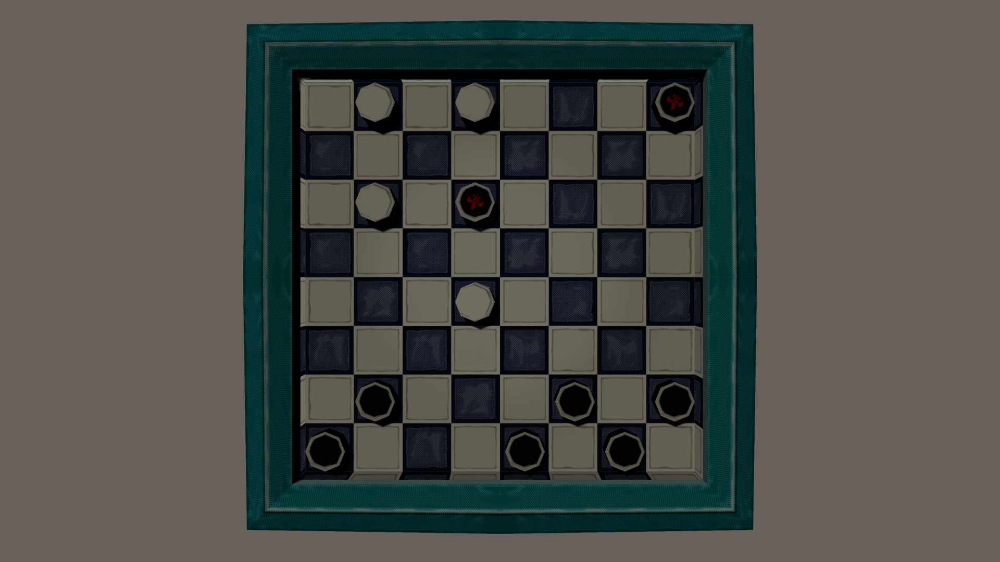
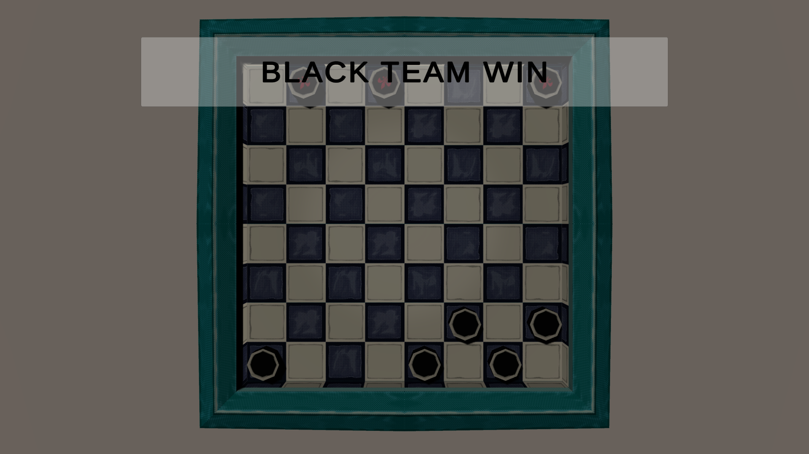

# Multiplayer-Checker-Unity-over-Tcp-Protocol
Open PlayerDatabase folder and run "PlayerDatabase - Shortcut.exe" before opening the game

Host

Client

GameStart on Client

GameStart on Host

Playing

Piece become KING

If a player Won an alert will show then all player will be brought back to main menu after 3 second

If a player DC'ed an alert will show then the remaining player will be brought back to main menu after 3 second

